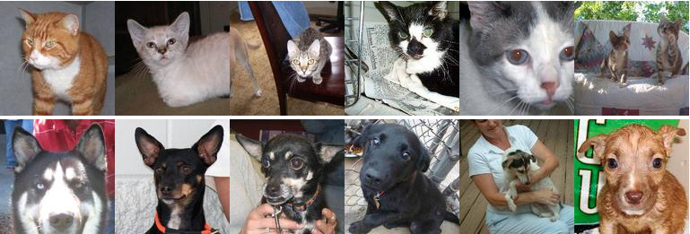

Cats Dogs Bench
===============

Cats and dogs dataset for Computer Vision. This benchmark is specifically designed to test the effectiveness of different pre-training techniques. Based on [https://www.kaggle.com/c/dogs-vs-cats](https://www.kaggle.com/c/dogs-vs-cats).

## examples

## contains
- sizes 32x32px, 64x64px, 128x128px.
- pre-training folder: 46000 cats and dogs, made up of 11500 cats, 11500 dogs, and their mirror images.
- test folder: 500 cats and 500 dogs.
- 1000 folder: 500 cats and 500 dogs.
- 500 folder: 250 cats and 250 dogs.
- 250 folder: 125 cats and 125 dogs.
- 100 folder: 50 cats and 50 dogs.

## size on disk
- 128x128: 277
- 64x64: 193M
- 32x32: 193M

## naming
Images are prefixed with either 'cat' or 'dog'.
